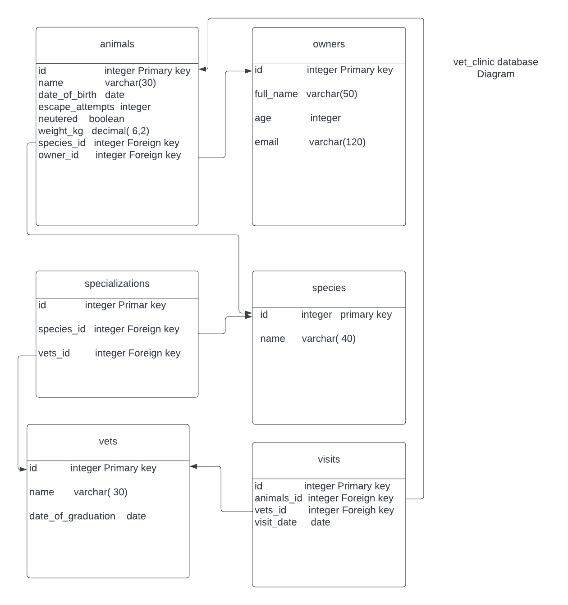

 
  
   

   

# 📗 Table of Contents

- [📖 About the Project](#about-project)
  - [🛠 Built With](#built-with)
    - [Tech Stack](#tech-stack)
    - [Key Features](#key-features)
  - [🚀 Live Demo](#live-demo)
- [💻 Getting Started](#getting-started)
  - [Setup](#setup)
  - [Prerequisites](#prerequisites)
  - [Install](#install)
  - [Usage](#usage)
  - [Run tests](#run-tests)
  - [Deployment](#deployment)
- [👥 Authors](#authors)
- [🔭 Future Features](#future-features)
- [🤝 Contributing](#contributing)
- [⭐️ Show your support](#support)
- [🙏 Acknowledgements](#acknowledgements)
- [❓ FAQ (OPTIONAL)](#faq)
- [📝 License](#license)

<!-- PROJECT DESCRIPTION -->

# 📖#Vet clinic database
Vet_clinic  is a database project where in we create relations for animals using relational database postgreSQL  for a vet clinic

## 🛠 Built With 

### Tech Stack 

- SQL
- PostgreSQL Data base

  

Database

  <ul>
    <li><a href="https://www.postgresql.org/">PostgreSQL</a></li>
  </ul>

<!-- Features -->

### Key Features 

-Create database and table for animals
-Insert animals' data into the table
-Make query for the animal table data

(<a href="#readme-top">back to top</a>)

<!-- GETTING STARTED -->

## 💻 Getting Started 

- To get a local copy up and running, follow these steps.

### Prerequisites
-In order to run this project you need:

-PostgreSQL database server installed

## Setup
Clone this repository to your desired folder:

git clone https://github.com/codeWithHyder/vet-clinic-database

cd vet-clinic-database

# Create database
-Connect to your PostgreSQL server with psql
> psql
postgres=#
-Create the database vet_clinic
postgres=# CREATE DATABASE vet_clinic;
-CREATE DATABASE
-Connect to your database vet_clinic. Inside your current session do:
postgres=# \c vet_clinic
You are now connected to database "vet_clinic" as user "postgres".
vet_clinic=#

That's it! Congratulations, you have created your database and connected to it. Next, we will add a table.

-Use schema.sql to create all tables.
-Use data.sql to populate tables with sample data.
-Check queries.sql for examples of queries that can be run on a newly created database.

<!-- AUTHORS -->

## 👥 Authors 

👤 **Ghulam Hyder Dar**

- GitHub: [@codeWithHyder](https://github.com/codeWithHyder)
- Twitter: [@Hyder](https://twitter.com/@hyder3512)
- LinkedIn: [@Hyder](https://www.linkedin.com/in/ghulam-hyder-dar/)

(<a href="#readme-top">back to top</a>)

<!-- FUTURE FEATURES -->

## 🔭 Future Features 
-Add new DML, DDL , and TCL commands.

<!-- CONTRIBUTING -->

## 🤠Contributing 

Contributions, issues, and feature requests are welcome!

Feel free to check the [issues page]().

(<a href="#readme-top">back to top</a>)

<!-- SUPPORT -->

## ⭐️ Show your support 

If you like this project please hit ⭐️ symbol

(<a href="#readme-top">back to top</a>)

<!-- ACKNOWLEDGEMENTS -->

## 🙠Acknowledgments 

I would like to thank:
 

- [Mr Abdus Satar and  Ms. Ritika ] my coding partners for their help and suggestions in completing this project.

(<a href="#readme-top">back to top</a>)

(<a href="#readme-top">back to top</a>)

<!-- LICENSE -->

## 📠License 

This project is [MIT](./LICENSE) licensed.

(<a href="#readme-top">back to top</a>)

